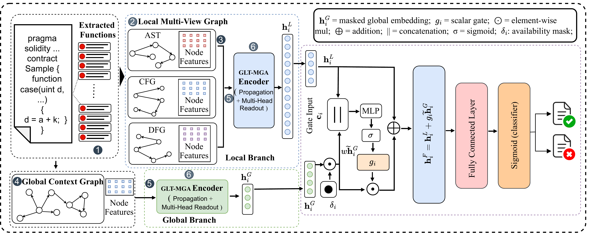

# GLT-MGA

Research artifact for **GLT-MGA**, a global-local multi-view graph-attention framework for smart-contract vulnerability detection.

GLT-MGA performs function-level **reentrancy (SWC-107)** and **timestamp-dependency (SWC-116)** detection. Its local branch aligns AST, CFG, and DFG evidence; its bounded global branch models relevant same-contract call and shared-state context; and gated fusion combines the local and global representations.

## Architecture

<p align="center">
  <a href="figures/figure_1_overview.pdf">
    
  </a>
</p>

The PNG above is used for GitHub preview. The paper-quality vector version is available at [`figures/figure_1_overview.pdf`](figures/figure_1_overview.pdf).

## Results

| Task | Configuration | Accuracy | Precision | Recall | F1 | AUC |
| --- | --- | ---: | ---: | ---: | ---: | ---: |
| Reentrancy | R2-S10-H4 | 98.74 | 97.58 | 99.18 | 98.37 | 99.84 |
| Timestamp dependency | R3-S15-H4 | 94.46 | 95.56 | 91.73 | 93.61 | 98.06 |

Values are percentages from seed `9930` and the fixed outer held-out test sets. Retained main-run artifacts are available under `results/main/`.

## Evaluation protocol

- Physical `valid.json` files retain a legacy filename but serve only as the outer held-out **test** partitions.
- A stratified, contract-level 10% internal validation subset is formed exclusively from outer training data.
- Internal training, internal validation, and outer test contracts are disjoint.
- Early stopping and checkpoint selection use internal validation loss only.
- Final evaluation restores the best validation checkpoint and applies the fixed decision threshold `0.45`.
- The fixed random seed used for the reported main experiments is `9930`.

See [`docs/DATA.md`](docs/DATA.md) and [`docs/REPRODUCIBILITY.md`](docs/REPRODUCIBILITY.md) for dataset and protocol details.

## Repository layout

```text
GLT-MGA.py                         Main GLT-MGA model entry point
BasicModel.py                      Training, validation, testing, and reporting
configs/main/                      Final task-specific configurations
experiments/ablation/
  GLT-MGA_ablation.py              Local-only ablation entry point
dataset/                           Solidity source corpus
train_data/                        Processed function-level train/test partitions
pipeline/                          Selected data-construction and ablation utilities
scripts/
  run_main.sh                      Main experiment launcher
  run_ablation.sh                  Ablation launcher
  verify_dataset.py                Dataset-integrity verification
tools/paper_figures/               Paper-figure generation utilities
results/                           Retained main, ablation, and sensitivity artifacts
figures/                           Manuscript figures
docs/                              Dataset and reproducibility documentation
```

## Environment setup

The tested stack is Python `3.7.12`, TensorFlow `1.14.0`, NumPy `1.21.6`, scikit-learn `1.0.2`, and Matplotlib `3.5.3`.

```bash
conda env create -f environment.yml
conda activate glt-mga
git lfs pull
python scripts/verify_dataset.py
```

Git LFS is required for the large processed JSON files and the PDF figure artifacts tracked by this repository.

## Run the main model

Run all commands from the repository root.

### Recommended reproduction commands

The launcher applies the task-specific configuration, seed `9930` by default, and the fixed decision threshold `0.45`.

```bash
bash scripts/run_main.sh reentrancy 9930
bash scripts/run_main.sh timestamp 9930
```

New run artifacts are written under:

```text
runs/main/reentrancy/
runs/main/timestamp/
```

### Equivalent direct Python commands

For **Reentrancy**:

```bash
python -u GLT-MGA.py \
  --task reentrancy \
  --config-file configs/main/reentrancy.json \
  --random_seed 9930 \
  --thresholds 0.45 \
  --log_dir runs/manual/reentrancy_seed9930
```

For **Timestamp Dependency**:

```bash
python -u GLT-MGA.py \
  --task timestamp \
  --config-file configs/main/timestamp.json \
  --random_seed 9930 \
  --thresholds 0.45 \
  --log_dir runs/manual/timestamp_seed9930
```

The final task configurations are:

| Task | Propagation rounds (R) | Max. substeps (S) | Attention heads (H) | Threshold |
| --- | ---: | ---: | ---: | ---: |
| Reentrancy | 2 | 10 | 4 | 0.45 |
| Timestamp dependency | 3 | 15 | 4 | 0.45 |

To inspect all command-line options:

```bash
python GLT-MGA.py --help
```

The main entry point supports `--task`, `--config-file`, `--random_seed`, `--thresholds`, `--log_dir`, `--data_dir`, and `--restore`.

Training time and exact floating-point results can vary across GPU/cuDNN stacks, while the released data partitions and evaluation protocol remain fixed.

## Ablation reproduction

Derived ablation JSON files are generated instead of committing duplicate processed datasets:

```bash
python pipeline/ablation_study.py --task reentrancy --variant all
python pipeline/ablation_study.py --task timestamp --variant all

bash scripts/run_ablation.sh reentrancy all 9930
bash scripts/run_ablation.sh timestamp all 9930
```

The `local` variant disables global propagation/readout and bypasses local-global fusion. Other variants preserve the global branch while altering the retained local views.

## Result artifacts

- `results/main/` contains retained artifacts for the reported main experiments.
- `results/rq2/` contains component-ablation artifacts.
- `results/rq3/` contains architecture-sensitivity artifacts.
- Checkpoints, caches, and routine logs are excluded from the curated result folders.

## Figures

Paper-quality vector figures are retained as PDFs under `figures/`. For inline rendering in this README, GitHub-friendly PNG previews should be committed alongside the PDFs.

The main architecture figure is:

```text
figures/figure_1_overview.pdf
figures/figure_1_overview.png
```

Other retained paper figures include the reentrancy and timestamp motivating examples, temporal propagation, multi-head attention, and propagation-round sensitivity plots.

## Citation

Citation information will be added when the final publication record and DOI are available.

